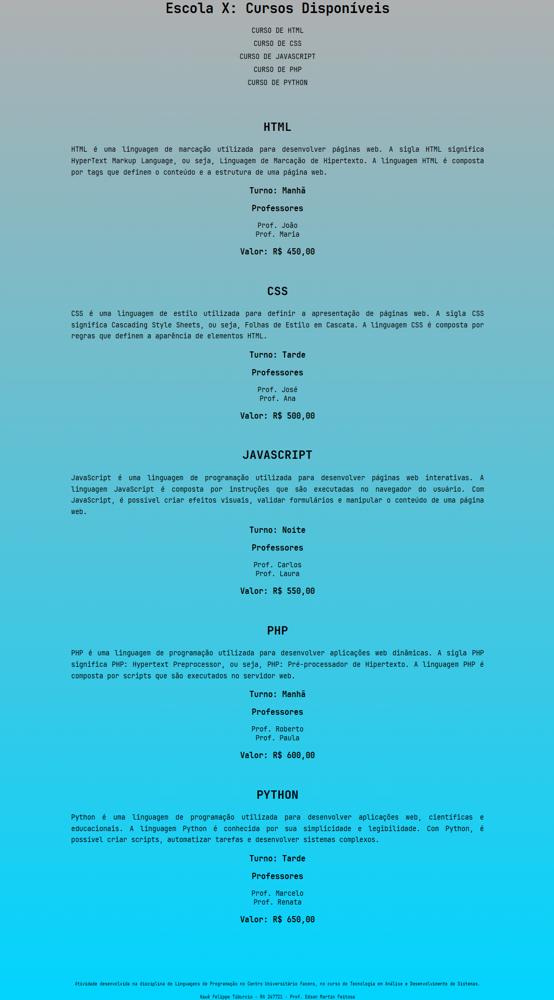
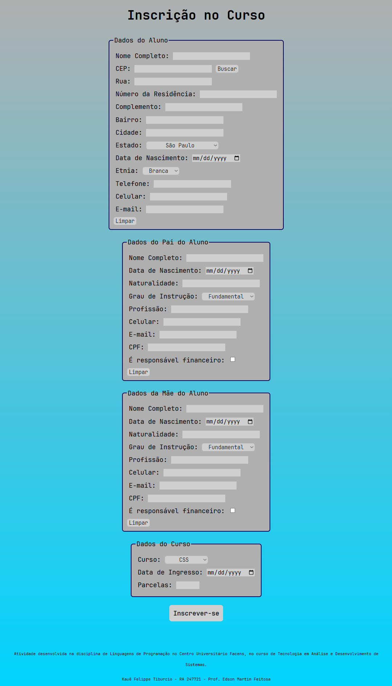
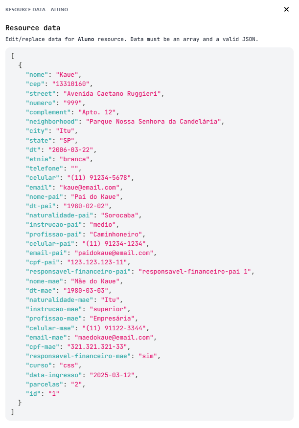

# Projeto de Listagem e Inscrição de Cursos

Este projeto foi desenvolvido para uma escola de cursos que precisa criar uma página HTML para listar os cursos disponíveis. A página deve mostrar os seguintes campos para cada curso: nome do curso, descrição, turno/horário, professores e valor. Cada curso possui um link para a inscrição, que redireciona o usuário para a tela de inscrição, passando o código do curso como parâmetro na querystring.

## Estrutura do Projeto

O projeto é composto por duas páginas principais:

1. **Página de Listagem de Cursos (Index.html)**: Esta página lista todos os cursos disponíveis com suas respectivas informações e links para inscrição.
2. **Página de Inscrição (Formulario.html)**: Esta página contém um formulário para que o usuário possa se inscrever no curso selecionado.

## BackEnd: API Mock

Para a persistência dos dados enviados pelo usuário, foi utilizado o mockAPI.io, simulando um CRUD simples por meio do endpoint `https://67d0b81d825945773eb1bced.mockapi.io/apilp/Aluno`

## Estilização

A estilização das páginas foi feita utilizando o arquivo `style.css`.

## Imagens

### Página de Listagem de Cursos

### Página de Inscrição

### MockAPI: Exemplo de JSON salvo por meio do formulário

## Tecnologias Utilizadas

- HTML
- CSS
- JavaScript

## Como Executar

1. Abra o arquivo `Index.html` em um navegador web para visualizar a lista de cursos.
2. Clique no link de inscrição de um curso para ser redirecionado para a página de inscrição (`Formulario.html`).

## Autor

Kauê Felippe Tiburcio - RA 247721

## Professor

Prof. Edson Martin Feitosa

## Instituição

Centro Universitário Facens - Curso de Tecnologia em Análise e Desenvolvimento de Sistemas
